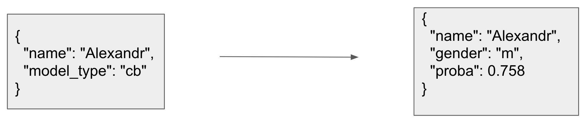

# Grafana practice

## Подготовка к запуску
Склонируйте репозиторий и перейдите в папку проекта, в директорию `grafana-practice` 
```shell
git clone https://github.com/SirDaBoz/grafana-workshop.git
cd grafana-workshop/grafana-practice/
```

## Запуск

Мы будем запускать все сервисы как docker-контейнеры. 
Grafana складывает внутреннюю информацию на диск. 
Чтобы при рестарте контейнера не потерять эту информацию, нужно создать volume для графаны. 

```shell
docker volume create --name=grafana-volume
```

Чтобы развернуть демонстрационный стенд Grafana, выполните.
```shell
docker-compose up -d
```

Команда развернет
- http://your_machine_ip:3000 - web ui графаны
- http://your_machine_ip:8080 - web ui графита. Так будут расшарено много портов для взаимодействия с графитом
- http://your_machine_ip:8000 - сервис с ML моделью. Модель предсказывает пол по имени.
Поиграться и побросать запросы в него можно со странички http://your_machine_ip:8000/docs
- http://your_machine_ip:8089 - web ui locust'а - инструмента, для нагрузочного тестирования.

Принципиальная схема взаимодействия контейнеров изображена на схеме


Конфигурация поднимаемых контейнеров: [docker-compose.yml](./docker-compose.yml). 
Изменять ее в стандартном сценарии не нужно.

#### Проверить список поднятых контейнеров можно так:
```shell
docker ps
```

#### Остановить работу всех контейнеров:
```shell
docker-compose down
```

## ML Service
На 8000 порту поднят сервис с ML моделью. Модель предсказывает пол по имени.

- your_ip:8000/predict_gender/ - handler (POST request), ручка для вызова сервиса из вне. Формат входа/выхода. 

- Допустимые model_type: `lr`, `cb` (logreg, catboost)
- Поиграться и побросать запросы в него можно со странички http://your_machine_ip:8000/docs - Swagger API

## Locust
Locust - это инструмент для нагрузочного тестирования.

http://your_machine_ip:8089 - web ui locust'а.

Чтобы подать нагрузку на ml сервис заполните поля следующим образом
- number of users: 10
- Spawn rate: 5
- Host: http://your_machine_ip:8000
- Нажмите `Start swarming`

## Внесение изменений в файл для нагрузочного тестирования и ML service
Внести изменения в код сервиса можно в файлике:
[service.py](./ml_service/service.py)

Внести изменения в код построения запросов для locust можно в файлике:
[locustfile.py](./locustfile.py)

Код написан таким образом, что пересобирать docker образы не нужно (если, конечно, вы не добавляете новые библиотеки).

## Знакомство c Graphite

### Компоненты
1. carbon - сервис, принимающий данные на вход
2. whisper - БД для сохранения данных
3. graphite-web - http://your_machine_ip:8080/ web ui

### Документация по graphite
- [Терминология](https://graphite.readthedocs.io/en/latest/terminology.html)
- [Функции для работы с рядами данных](https://graphite.readthedocs.io/en/latest/functions.html)
- [Тэги](https://graphite.readthedocs.io/en/latest/tags.html)


## Знакомство с web UI Grafana

### Базовые шаги
1. Web UI Grafana: http://your_machine_ip:3000
1. Стандартные login/pswd: `admin`/`admin`
1. Навигация по разным страницам происходит через левую панель со значками.
1. Добавляем источник данных. Перейдите на страницу `Data sources` -> `Graphite`
   - Тип: Graphite
   - url: http://your_machine_ip:8080 (важно указать именно ip вашей машины, а не localhost)
   - остальное не меняем
   - Жмем `Save & Test`. Сообщение `Cannot read properties of undefined (reading 'get')` - не страшно
1. Можно проверить чтение данных из graphite в режиме `Explore`. Накликайте график по CPU Usage у Сarbon в поле `Series`: `carbon` -> `aggregator` -> `some-uid` -> `cpuUsage`
1. Добавляем папку для dashboard'ов: на левой панели кнопка `Dashboards` -> `+ New folder`
1. Добавляем первый dashboard: 
   - на левой панели кнопка `Dashboards` -> `+ New dashbord`
   - далее выбираем `Add new panel`
   - в поле Series можно накликать график по CPU Usage у Сarbon: `carbon` -> `aggregator` -> `some-uid` -> `cpuUsage`

Дальнейшее ознакомление с интерфейсов оставляю на личное усмотрение. 
На workshop'е будем продолжать изучать и настраивать grafana и графики.

## Удалить созданные объекты на виртуальной машине

- Почистить volumes можно так: `docker volume prune`
- Почистить все объекты: `docker system prune --volumes`

[Полная документация](https://docs.docker.com/config/pruning/)
